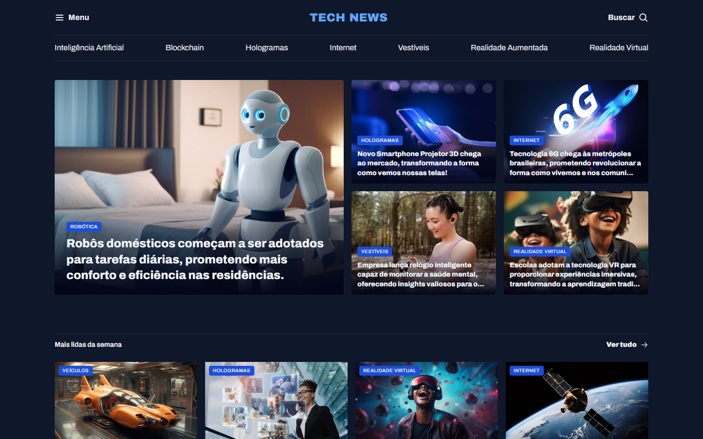

# 📰 Portal de Notícias

Layout de um portal de notícias feito com HTML e CSS.

🔗 **[Ver online](https://kayandenizo.github.io/fullstack-portal-de-noticias/)**

## Como rodar

Não precisa instalar nada: basta abrir o arquivo `index.html` no navegador (ou usar a extensão **Live Server** do VS Code).

---

Feito por [Kayan Denizo](https://github.com/KayanDenizo).
